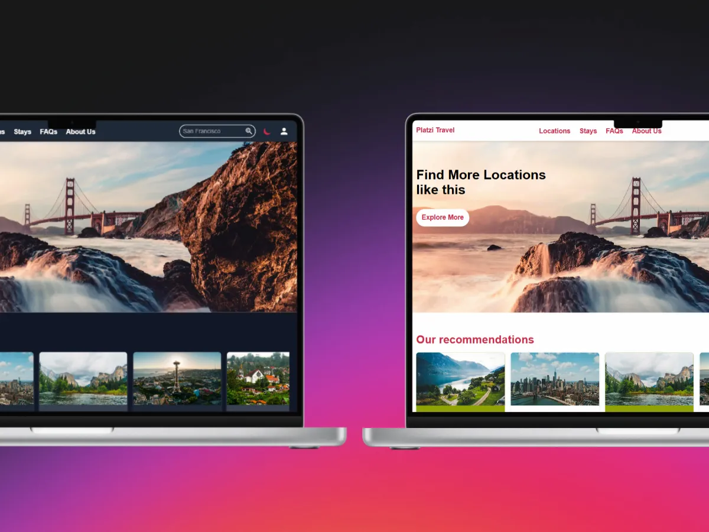

<a name="readme-top"></a>




# Platzi Travel 

Platzi Travel es un proyecto que creamos en el <a href="https://platzi.com/cursos/tailwind/" target="_blank">Curso Básico de Tailwind 2 y 3</a> en **Platzi**, en el que aprendimos a crear una landing page con Tailwind CSS. Esta aplicación web utiliza Tailwind CSS para el diseño de la interfaz de usuario, proporcionando una experiencia de usuario flexible y moderna.

<div>
Este seria el diseño de Figma:

[Diseño de Figma](https://www.figma.com/design/aPbr2Rhd5SCUjNYu6NRPPB/Platzi-Travel-Mockups?node-id=0-1&node-type=canvas&t=nMPXsoe21iDMAdtk-0)

</div>

## Mejoras
<div align="center">
  <a href="https://googlechrome.github.io/lighthouse/viewer/?gist=99622f18035b9cff87565e05fee8f214" target="_blank">
    
  </a>
</div>

En este proyecto me tome la libertad de cambiar algunas cosas como:

* Mejore el diseño de la landing page y la optimice para diferentes diseños de pantallas.
* Navegación fluida y responsiva gracias a Tailwind CSS.
* Optimice todos los recursos y priorice tiempos de cargas mas rápidos para el usuario.
* Temática clara y oscura implementada.
* Optimice el SEO y Cree los Open Graph para compartir el link.
<p align="right">(<a href="#readme-top">volver arriba</a>)</p>

## 🛠️ Stack

* [HTML](https://developer.mozilla.org/en-US/docs/Web/HTML)
* [Tailwind CSS](https://tailwindcss.com/)
* [JavaScript](https://developer.mozilla.org/en-US/docs/Web/JavaScript)
<p align="right">(<a href="#readme-top">volver arriba</a>)</p>


## Instalación

1. Clona el repositorio en tu máquina local:

   ```bash
   git clone https://github.com/EdGonzz/platzi-travel-tailwind-course.git
   ```

2. Navega al directorio del proyecto:

   ```bash
   cd platzi-travel-tailwind-course
   ```

3. Instala las dependencias del proyecto:

   ```bash
   npm install
   ```

4. Abre el archivo `index.html` en tu navegador web favorito, y si vas a realizar modificaciones, recuerda ejecutar el comando `npm run dev` para actualizar el archivo de `tailwind.config.js`.
<p align="right">(<a href="#readme-top">volver arriba</a>)</p>


## Uso

Navega a la URL del proyecto [aquí](https://edgonzz.github.io/platzi-travel-tailwind-course/) para ver la página en funcionamiento.
<p align="right">(<a href="#readme-top">volver arriba</a>)</p>

## Contribución

1. Haz un fork del proyecto.
2. Crea una nueva rama para tus modificaciones (`git checkout -b mi-nueva-rama`).
3. Realiza tus cambios y haz un commit (`git commit -am 'Añadir nueva funcionalidad'`).
4. Empuja la rama (`git push origin mi-nueva-rama`).
5. Abre un Pull Request.
<p align="right">(<a href="#readme-top">volver arriba</a>)</p>


## Licencia

Este proyecto está licenciado bajo la Licencia MIT. Consulta el archivo `LICENSE` para más detalles.
<p align="right">(<a href="#readme-top">volver arriba</a>)</p>


## Autores

- [Edwin Contreras](https://github.com/EdGonzz)
<p align="right">(<a href="#readme-top">volver arriba</a>)</p>
